# Real-Time Transaction Monitoring System

A complete real-time data pipeline and monitoring dashboard for transaction analytics and fraud detection.

## 🏗️ Architecture

```
┌─────────────────┐    ┌─────────────────┐    ┌─────────────────┐
│   Data Pipeline │    │      API        │    │   Dashboard     │
│                 │    │                 │    │                 │
│ • Apache Kafka  │◄──►│ • Node.js       │◄──►│ • React/Next.js │
│ • Apache Pinot  │    │ • Express       │    │ • TypeScript    │
│ • Data Flow     │    │ • SSE Streams   │    │ • Clean Arch    │
└─────────────────┘    └─────────────────┘    └─────────────────┘
```

## 📁 Project Structure

```
realtime-transaction-monitoring/
├── data-pipeline/          # Kafka + Pinot data processing
│   ├── conf/               # Pinot configurations
│   ├── crawl_data/         # Producers/consumers
│   ├── data/               # Sample datasets
│   ├── scripts/            # Utility scripts
│   └── segments/           # Pinot data segments
├── dashboard/              # React dashboard (Clean Architecture)
│   ├── src/                # TypeScript/React code
│   ├── public/             # Static assets
│   └── package.json        # Frontend dependencies
├── api/                    # Backend API server
│   ├── src/                # Server code
│   ├── package.json        # Backend dependencies
│   └── server.js           # Express server
├── docker/                 # Docker configurations
│   ├── docker-compose.yml  # Full stack deployment
│   └── README.md           # Docker documentation
├── docs/                   # Documentation
└── README.md               # This file
```

## 🚀 Quick Start

### Prerequisites
- Docker & Docker Compose
- Node.js 18+ (for local development)
- Python 3.8+ (for data pipeline scripts, optional)

### Environment Setup
Copy the example environment files:
```bash
# Root environment for Docker Compose
cp env.example .env

# API server environment
cp api/env.example api/.env

# Dashboard environment
cp dashboard/transaction-dashboard/env.example dashboard/transaction-dashboard/.env.local
```

### Option 1: One-Command Full System (Recommended)
```bash
# Windows Command Prompt
manage.bat start

# Linux/Mac
make start
```

### Option 2: Manual Setup

#### Windows Command Prompt:
```batch
# Install dependencies
manage.bat install

# Start full system
manage.bat start
```

#### Linux/Mac:
```bash
# Install dependencies
make install

# Start full system
make start
```

### Access the Dashboard
Open [http://localhost:3000](http://localhost:3000) in your browser

### Alternative: Development Mode

#### Windows:
```batch
# Show development setup instructions
manage.bat dev

# Then run in separate terminals:
# 1. cd docker; docker-compose -f docker-compose.pipeline.yml up -d
# 2. cd api; npm run dev
# 3. run_react_dashboard.bat
```

#### Linux/Mac:
```bash
# Show development setup instructions
make dev

# Then run in separate terminals:
# 1. cd docker && docker-compose -f docker-compose.pipeline.yml up -d
# 2. cd api && npm run dev
# 3. ./run_react_dashboard.sh
```

## 🛠️ Technology Stack

### Backend
- **Node.js + Express**: API server
- **Apache Kafka**: Message streaming
- **Apache Pinot**: Real-time analytics
- **Docker**: Containerization

### Frontend
- **Next.js 14**: React framework
- **TypeScript**: Type safety
- **Tailwind CSS**: Styling
- **Shadcn/ui + Radix**: UI components
- **Recharts**: Data visualization

### Data Processing
- **Python**: Data pipeline scripts
- **Kafka Python**: Message producers/consumers
- **Faker**: Synthetic data generation

## 🔧 Configuration

### Environment Variables

#### API Server (api/)
```env
PORT=3000
PINOT_HOST=localhost
PINOT_PORT=8099
UPDATE_INTERVAL=2000
```

Copy `api/env.example` to `api/.env` and adjust values as needed.

#### Dashboard (dashboard/transaction-dashboard/)
```env
NEXT_PUBLIC_API_URL=http://localhost:3000
NEXT_PUBLIC_UPDATE_INTERVAL=2000
```

Copy `dashboard/transaction-dashboard/env.example` to `dashboard/transaction-dashboard/.env.local` and adjust values as needed.

#### Data Pipeline (docker/)
```env
PUBLIC_IP=localhost
BOOTSTRAP_SERVERS=kafka:9092
TOPIC_RAW=transactions_raw
TOPIC_CLEAN=transactions_rt
GROUP_ID=rt-processor-v1
DEDUP_MAX_KEYS=50000
```

Copy `env.example` to `.env` in the root directory and adjust values as needed.

## 📈 Data Flow

```mermaid
flowchart LR
    %% Data Generation Row
    A[📊 Synthetic Data Generator<br/>Python + Faker] --> B[Kafka Producer<br/>rt_producer.py]
    B --> C[(💬 Kafka Topic<br/>transactions_raw)]

    %% Processing Row
    C --> D[Kafka Consumer<br/>rt_processor.py]
    D --> E[(💬 Kafka Topic<br/>transactions_rt)]
    E --> F[📥 Apache Pinot<br/>Real-time Ingestion]

    %% Storage & API Row
    F --> G[(🗄️ Pinot Tables<br/>transactions)]
    G --> H[🚀 API Server<br/>Node.js + Express]

    %% Dashboard Row
    H --> I[📱 Dashboard<br/>React + Next.js]

    %% Real-time Connections
    I -.->|Server-Sent Events| H
    H -.->|Real-time Queries| G

    %% Styling
    classDef source fill:#e1f5fe,stroke:#01579b,stroke-width:2px
    classDef kafka fill:#fff3e0,stroke:#ef6c00,stroke-width:2px
    classDef processing fill:#f3e5f5,stroke:#6a1b9a,stroke-width:2px
    classDef storage fill:#e8f5e8,stroke:#2e7d32,stroke-width:2px
    classDef app fill:#fff8e1,stroke:#f57f17,stroke-width:2px

    class A source
    class B,C,D,E kafka
    class F,G processing
    class H,I app
```



## 🧪 Development

### Running Individual Components

#### Data Pipeline Only
```bash
cd docker
docker-compose -f docker-compose.pipeline.yml up -d
```

#### API Server Only
```bash
cd api
npm install && npm run dev
```

#### Dashboard Only
```bash
cd dashboard
npm install && npm run dev
```

### Testing Data Flow
```bash
# Check Kafka topics
docker exec kafka kafka-topics --list --bootstrap-server localhost:9092

# Query Pinot
curl "http://localhost:8099/query/sql?sql=SELECT%20COUNT(*)%20FROM%20transactions"
```

## 🛠️ Project Management

This project includes convenient management scripts for easy operation:

### Windows Users
```batch
# Command Prompt
manage.bat <command>
```

### Linux/Mac Users
```bash
# Make commands
make <command>
```

### Available Commands
- `install` - Install all dependencies
- `start` - Start the full system
- `stop` - Stop all services
- `clean` - Clean up containers and volumes
- `dev` - Show development setup instructions
- `logs` - Show service logs
- `status` - Show service status
- `test` - Run tests
- `build` - Build for production
- `dashboard` - Start dashboard only

### Examples
```batch
# Windows
manage.bat start
manage.bat status
manage.bat clean

# Linux/Mac
make start
make status
make clean
```

## 🚀 Deployment

### Production Deployment
```bash
# Build and deploy
cd docker
docker-compose -f docker-compose.prod.yml up -d
```

### Scaling
```bash
# Scale Pinot servers
docker-compose up -d --scale pinot-server=3

# Scale API servers
docker-compose up -d --scale api=2
```

## 📚 Documentation

- [Data Pipeline](./data-pipeline/README.md)
- [API Server](./api/README.md)
- [Dashboard](./dashboard/README.md)
- [Docker Setup](./docker/README.md)
- [Architecture Guide](./docs/ARCHITECTURE.md)
- [Development Guide](./docs/DEVELOPMENT.md)
